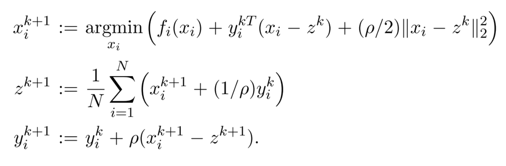

# 优化框架

## 一致性优化

- 优化目标：

  $$
  \min f(x)  = \sum^N f_i(x)
  $$

  e.g. MLE，其中限制$f_i$为凸函数，$x$表示代估计参数$\Theta$，数据被当作常量表现在$f_i$中
- 在原先的介绍中，在给定光滑，常用的方法：Gradient, Newton, L-BFGS
- 当不一定光滑时即引出本节讨论
- 在上面的公式中，$N$并不一定需要exactly为样本量，也可以roughly按照分块进行切分表示分块数

**一致性问题**

- 是否可以保证对于$N$组优化问题，可以得到相同的对于参数$X$的估计，这个相等的参数值记为约束：$x_i -z = 0, (i=1,...,N)$
- 可以证明该约束性优化和上述无约束优化是等价的
- 而该约束优化问题又可以认为是一个ADMM问题
- 在没有交换信息的情况下，机器可以完成N组无约束优化，而为了实现约束需要额外的**信息交换**

**迭代算法：**

- $i = 1,...,N$
- 可以证明 $z^k = \bar x ^k$
- 由迭代表达式可见，$x^k$ 的更新操作是并行的（这既节省了计算时间，同时使得大规模数据运算成为可能）

在具体的实现中：数据的发送相当于`MAP`，汇总相当于`REDUCE`

## 共享优化问题

- 优化问题：
$$\min \sum_{i=1}^N f_i(x_i) + g(\sum_{i=1}^N x_i)$$
也就是说 这里的参数x本身就是许多

- 难点在于这里的f和g的相互作用关系

在共享优化中，转换：

$$\min \sum f_i(x_i)+g(\sum z_i)\\s.t. ~x_i - z_i =0$$

$ x_i \in \R^n, z = (z_1 , \ldots ,z_N) \in \R^{N\times n}, u_i \in \R^n$

在化简后的迭代公式中
$\bar z\in \R^N, u_i$的也整合为了$u\in \R^n$