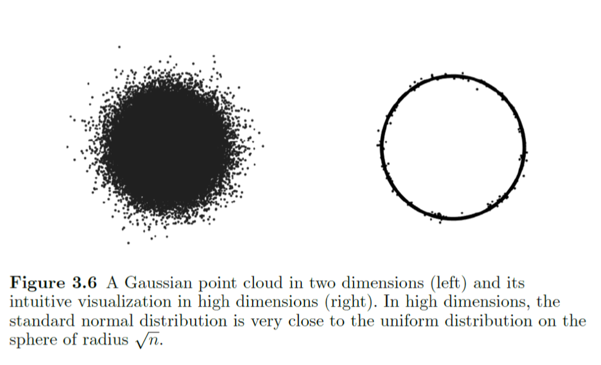

#HDP

## 正态分布

### 什么是正态分布

- 正态分布是复杂总和的有限概率分布，是一系列随机机制的总和叠加
- 元误差理论
  - 误差是许多微小随机误差的总和，误差可以写成算术平均的形式，由CLT误差的分布是正态分布
  - 记真实值为$\mu$，测量值为$X$，误差为$\varepsilon$，则$X=\mu-\varepsilon$，$\varepsilon$是随机变量，认为由许多不可分割的微小随机误差（元误差$e_i$）的总和构成，即$\varepsilon=\sum_{i=1}^{\infty} e_i = \lim_{n\to\infty} n\cdot\sum_{i=1}^{n} e_i/n = \lim_{n\to\infty} n\cdot\bar{e}$，其中$\bar{e}$是元误差的均值，$n$是元误差的个数。假设每个元误差$e_i$被观测到的概率为$p$，则$\varepsilon\sim Bi(n,p)$，由De Moivre-Laplace CLT, $\varepsilon\sim N(np,np(1-p))$，即$\varepsilon\sim N(0,\sigma^2)$，其中$\sigma^2=np(1-p)$.

- 高维正态分布
  
    一个高维的正态分布会分布在一个球面的周围，非常类似一个在以$\sqrt{n}$为半径的球面上的均匀分布

### 加权正态分布

*[Definition]* **(Convex Combination)**
Given point $x_1,x_2,...,x_m \in \mathbb{R}^n$ and $\lambda_1,\lambda_2,...,\lambda_m \in \mathbb{R}$ with $\sum_{i=1}^{m} \lambda_i = 1, \lambda_i \geq 0$, the convex combination of $x_1,x_2,...,x_m$ is $\sum_{i=1}^{m} \lambda_i x_i$.

*[Definition]* **(Convex Hull)**
Let $T\subseteq \mathbb{R}^n$, the **convex hull of $T$** is the set of all convex combinations of points in $T$:
$$
\text{conv}(T) = \left\{ \sum_{i=1}^{m} \lambda_i x_i \mid x_1,x_2,...,x_m \in T, \lambda_1,\lambda_2,...,\lambda_m \in \mathbb{R}, \sum_{i=1}^{m} \lambda_i = 1, \lambda_i \geq 0 \right\}
$$

*[Theorem]* **(Caratheodory's Theorem)**
Let $T\subseteq \mathbb{R}^n$ and there is a point $x\in \text{conv}(T)$, then that point can be written as a convex combination of at most $n+1$ points in $T$.
Here the $n+1$ points cannot be  improved to $n$.

*[Theorem]* **(Approximate Caratheodory's Theorem)**
Let $T\subseteq \mathbb{R}^n$ whose diameter is bounded by $1$, (i.e. $\text{diam}(T) = \sup_{x,y\in T} ||x-y|| \leq 1$). Then for evey point $x\in \text{conv}(T)$, given arbitrary $k\in \mathbb{N}$, there exists $x_1,x_2,...,x_k \in T$ such that
$$
\left\| x -\frac1k \sum_{i=1}^{k}  x_i \right\|_2 \leq \frac{1}{\sqrt{k}}
$$

> **Note**
> - $k$ is irrelevant to the dimension of the space.
> - The coefficient of the convex combination can be all equal.

*[Proof]* **(B. Maurey Empirical Method)**

Without loss of generality, we can assume that the radius of $T$ is less than $1$:
$$
\|t\|_2 \leq 1, \forall t\in T
$$

Given a point $x\in \text{conv}(T)$, we can write it as a convex combination of some points in $T$:
$$
x = \sum_{i=1}^{m} \lambda_i z_i, \small\text{ where } z_i\in T, \lambda_i\geq 0, \sum_{i=1}^{m} \lambda_i = 1
$$

Regard $\lambda_i$ as the probability of choosing $z_i$, i.e. $\mathbb{P}(z_i) = \lambda_i$, then $x$ is the expectation of the random variable $Z$:
$\mathbb{E}[Z] = x$.

Now consider a realization of $Z$, i.e. independent and identically random vectors $Z_1,Z_2,...,Z_k$ with the same distribution as $Z$. Then according to the **[[Strong Law of Large Numbers]]**, if $k\to\infty$, then
$$
\frac1k \sum_{i=1}^{k} Z_i \xrightarrow{a.s.} \mathbb{E}[Z] = x
$$

Measure the distance between the realization and the expectation using Mean Square:
$$
\begin{aligned}
\mathbb{E} \left \|  x- \frac1k \sum_{i=1}^{k} Z_i  \right \|_2^2 &\equiv \frac{1}{k^2} \mathbb{E} \left \| \sum_{i=1}^{k} \left( Z_i - x \right) \right \|_2^2 \\
&= \frac{1}{k^2} \sum_{i=1}^{k} \mathbb{E} \left \|  Z_i - x \right \|_2^2 \quad \small{\text{since } \mathbb{E}( Z_i - x) = 0} \\
\end{aligned}
$$
The last equality is equivalent to the variance of sum of independent random variables is the sum of their variances.

Now claim that $\left\| x - \frac1k \sum_{i=1}^{k} Z_i \right\|_2 \leq \frac{1}{k}$, i.e. the Mean Square is bounded by $\frac{1}{k}$. It can be proved by the following steps:

Consider each term in the sum:
$$
\begin{aligned}
\mathbb{E} \left \|  Z_i - x \right \|_2^2 &= \mathbb{E} \left \|  Z_i - \mathbb{E}Z \right \|_2^2 \\
&\stackrel{\dagger}{=} \mathbb{E} \left \|  Z \right \|_2^2 - \left\|\mathbb{E}Z\right \|_2^2 \\
&\leq \mathbb{E} \left \|  Z \right \|_2^2 \quad (\small{\text{since } \left\|\mathbb{E}Z\right \|_2^2 \geq 0}) \\
&\leq 1 \quad( \small{\text{since } Z\in T, \left\|Z\right \|_2 \leq 1}) \\
\end{aligned}
$$ where $\dagger$ holds as:
$$\begin{aligned}
\mathbb{E} \left \|  Z - \mathbb{E}Z \right \|_2^2 &= \mathbb{E}\left((Z - \mathbb{E}Z)^\top (Z - \mathbb{E}Z)\right) \\
&= \mathbb{E}\left(Z^\top Z - 2Z^\top \mathbb{E}Z + \mathbb{E}Z^\top \mathbb{E}Z\right) \\
&= \mathbb{E}\left(Z^\top Z\right) - 2\mathbb{E}\left(Z^\top \mathbb{E}Z\right) + \mathbb{E}\left(\mathbb{E}Z^\top \mathbb{E}Z\right) \\
&= \mathbb{E}\left(Z^\top Z\right) - 2\mathbb{E}Z^\top \mathbb{E}Z + \mathbb{E}Z^\top \mathbb{E}Z \\
&= \mathbb{E}\left\|Z\right\|_2^2 - \left\|\mathbb{E}Z\right \|_2^2
\end{aligned}$$ Actually in the form of variance, it is $\text{Var}(Z) = \sum_{i=1}^{n} (\mathbb{E}Z_i^2 - \left(\mathbb{E}Z_i\right)^2)$.

Then if $\mathbb{E} \left \|  Z_j - x \right \|_2^2 \leq 1$, then
$$
\begin{aligned}
\mathbb{E} \left \|  x- \frac1k \sum_{i=1}^{k} Z_i  \right \|_2^2 & = \frac{1}{k^2} \sum_{i=1}^{k} \mathbb{E} \left \|  Z_i - x \right \|_2^2 \\
&\leq \frac{1}{k^2} \sum_{i=1}^{k} 1 = \frac{1}{k}
\end{aligned}
$$

Denote $Y = \left \|  x- \frac1k \sum_{i=1}^{k} Z_i  \right \|_2^2 \leq 0$, then according to the **[[Markov's Inequality]]**, for any $\epsilon > 0$,
$$
\begin{aligned}
\mathbb{P}(Y \geq \epsilon) &\leq \frac{\mathbb{E}Y}{\epsilon} \\
\Rightarrow ~\mathbb{P}(Y \geq \frac{1}{k}) &\leq k\cdot\mathbb{E}Y \leq \frac{k}{k} = 1 \quad (\small\text{let} ~ \epsilon = \frac{1}{k})
\end{aligned}
$$
It means that $\mathbb{P}(Y < \frac{1}{k}) > 0$, i.e. there exists a realization of $Z_1,Z_2,...,Z_k$ such that $\left \|  x- \frac1k \sum_{i=1}^{k} Z_i  \right \|_2^2 \leq \frac{1}{k}$.

Therefore, for any $x\in \text{conv}(T)$, given arbitrary $k\in \mathbb{N}$, there exists $x_1,x_2,...,x_k \in T$ such that 
$$
\left\| x -\frac1k \sum_{i=1}^{k}  x_i \right\|_2 \leq \frac{1}{\sqrt{k}}
$$
Here, those $x_1,x_2,...,x_k$ are the $k$ realizations of $Z_1,Z_2,...,Z_k$.
$\blacksquare$

