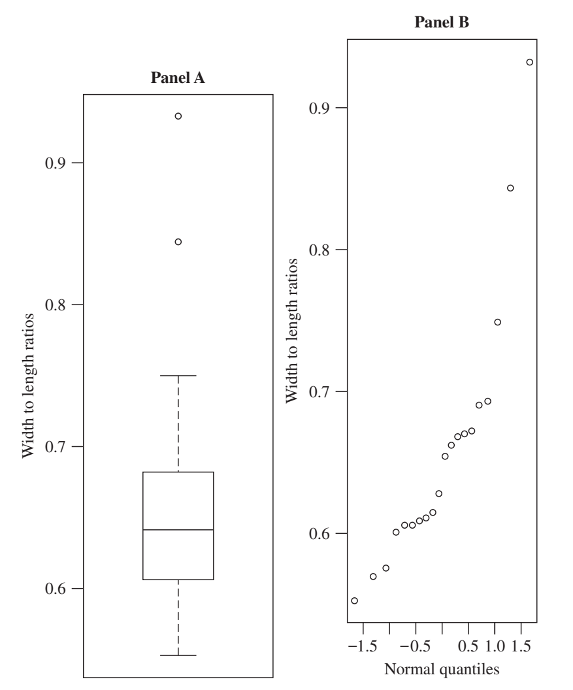
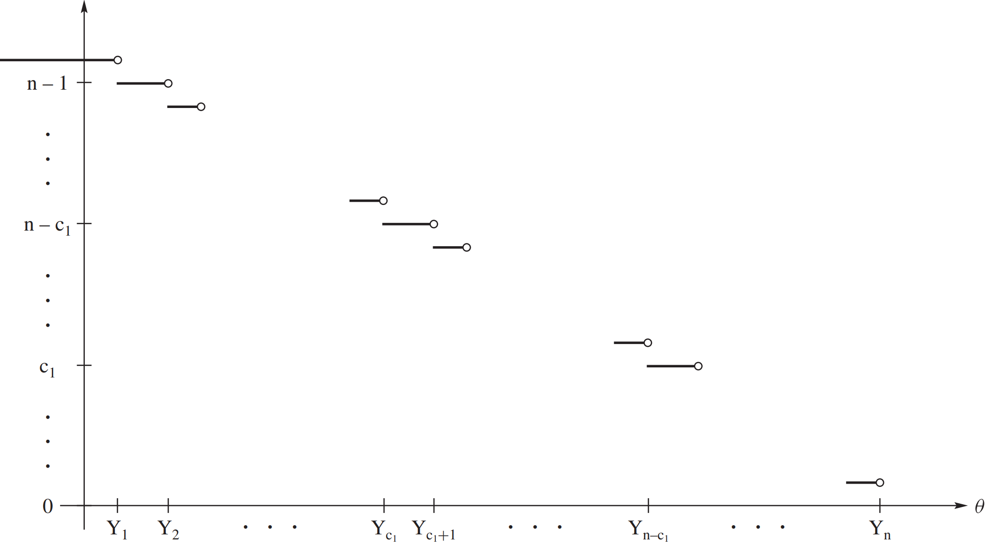

## 10.2 样本中位数与符号检验 (Sample Median and the Sign Test)

在本节中，我们将讨论使用样本中位数对分布中位数进行推断。该讨论的基础是符号检验统计量 (Sign Test Statistic)，我们将首先介绍这一统计量。

设 \( X_1, X_2, \dots, X_n \) 是遵循如下位置模型的随机样本：

\[
X_i = \theta + \epsilon_i, \quad \text{(10.2.1)}
\]

其中，\( \epsilon_1, \epsilon_2, \dots, \epsilon_n \) 是独立同分布 (iid) 且具有累积分布函数 \( F(x) \)、概率密度函数 \( f(x) \) 且中位数为0的随机变量。注意，在第10.1节中，位置泛函 (Location Functional) 是中位数，因此 \( \theta \) 是 \( X_i \) 的中位数。

我们首先从以下单侧假设检验开始：

\[
H_0: \theta = \theta_0 \quad \text{v.s.} \quad H_1: \theta > \theta_0 \quad \text{(10.2.2)}
\]

考虑统计量：

\[
S(\theta_0) = \# \{ X_i > \theta_0 \}, \quad \text{(10.2.3)}
\]

这被称为**符号统计量 (Sign Statistic)**，因为它计算了样本中比 \( \theta_0 \) 大的观测值的数量。我们也可以用以下方式来表示 \( S(\theta_0) \)：

\[
S(\theta_0) = \sum_{i=1}^{n} I(X_i > \theta_0), \quad \text{(10.2.4)}
\]

其中，函数 \( I(x > a) \) 用于指示 \( x > a \) 时为1，否则为0。注意，如果 \( H_0 \) 成立，我们期望一半的观测值大于 \( \theta_0 \)，而如果 \( H_1 \) 成立，我们期望大于 \( \theta_0 \) 的观测值多于一半。因此，假设检验可以通过以下规则进行：

\[
\text{如果} \ S(\theta_0) \geq c, \ \text{则拒绝} \ H_0 \ \text{，支持} \ H_1。 \quad \text{(10.2.5)}
\]

在零假设 \( H_0 \) 下，随机变量 \( I(X_i > \theta_0) \) 是独立同分布的，且服从 \( \text{Bernoulli}(1, 1/2) \) 分布。因此，符号统计量 \( S(\theta_0) \) 在零假设下服从 \( \text{Binomial}(n, 1/2) \) 分布，其均值为 \( n/2 \) 且方差为 \( n/4 \)。注意，在 \( H_0 \) 成立时，符号检验不依赖于 \( X_i \) 的具体分布形式。通常，我们称这种检验为**分布无关检验 (Distribution-Free Test)**。

对于显著性水平为 \( \alpha \) 的检验，选择 \( c \) 为 \( c_\alpha \)，其中 \( c_\alpha \) 是 \( \text{Binomial}(n, 1/2) \) 分布的上 \( \alpha \) 临界值点。由于检验统计量具有离散分布，精确检验的显著性水平 \( \alpha \) 只有有限个可选值。通过大多数计算机软件包都可以很容易地找到 \( c_\alpha \) 的值。例如，R语言中的 `pbinom(0:15, 15, 0.5)` 命令可以返回 \( n = 15 \)、\( p = 0.5 \) 的二项分布累积分布函数，从而可以查看所有可能的显著性水平。

对于给定的数据集，符号检验的 \( p \)-值由下式给出：

\[
\hat{p} = P_{H_0}(S(\theta_0) \geq s)
\]

其中，\( s \) 是基于样本计算的 \( S(\theta_0) \) 的观测值。通过 R 语言命令 `1 - pbinom(s - 1, n, 0.5)` 可以计算 \( \hat{p} \)。

有时，为了使用大样本检验，我们基于检验统计量的渐近分布来构造检验。根据中心极限定理，在零假设 \( H_0 \) 下，标准化统计量 \( [S(\theta_0) - (n/2)]/\sqrt{n/2} \) 渐近服从正态分布 \( N(0, 1) \)。因此，大样本检验可以通过以下规则进行：

\[
\text{如果} \quad \frac{S(\theta_0) - (n/2)}{\sqrt{n/2}} \geq z_\alpha \quad \text{则拒绝} \ H_0 \quad \text{(10.2.6)}
\]

请参见习题 10.2.2。

我们简要提及一下双侧假设：

\[
H_0: \theta = \theta_0 \quad \text{对比} \quad H_1: \theta \neq \theta_0 \quad \text{(10.2.7)}
\]

对于双侧假设检验，以下对称决策规则似乎是合理的：

\[
\text{如果} \ S(\theta_0) \leq c_1 \ \text{或} \ S(\theta_0) \geq n - c_1， \ \text{则拒绝} \ H_0 \quad \text{(10.2.8)}
\]

对于显著性水平为 \( \alpha \) 的检验，选择 \( c_1 \) 使得 \( \alpha/2 = P_{H_0}(S(\theta_0) \leq c_1) \)。回想一下，\( p \)-值为：

\[
\hat{p} = 2 \cdot \min \{ P_{H_0}(S(\theta_0) \leq s), P_{H_0}(S(\theta_0) \geq s) \}
\]

其中，\( s \) 是基于样本计算的 \( S(\theta_0) \) 的观测值。


---

***例 10.2.1 (Shoshoni 矩形)***

黄金矩形是一个矩形，其宽度 \( w \) 与长度 \( l \) 的比值为黄金比，约为 0.618。黄金矩形可以通过各种方式来定义。例如，黄金矩形可以通过 \( w/l = l/(w + l) \) 来表示。黄金矩形被认为是西方文明中的美学标准，并且自古希腊以来就出现在艺术和建筑中。如今，这一比例出现在信用卡和名片等物品中。

在一项文化人类学研究中，DuBois (1960) 报告了对 Shoshoni 族珠编篮子的研究。这些篮子包含珠编的矩形，问题是 Shoshoni 族是否使用与西方相同的美学标准。设 \( X \) 表示 Shoshoni 族篮子的宽长比，设 \( \theta \) 为 \( X \) 的中位数。感兴趣的假设为：

\[
H_0: \theta = 0.618 \quad \text{对比} \quad H_1: \theta \neq 0.618
\]

这些是假设的双侧检验。根据前述讨论，符号检验在 \( S(0.618) \leq c \) 或 \( S(0.618) \geq n - c \) 时拒绝 \( H_0 \)。

从 20 个 Shoshoni 族篮子中的宽长比样本得到如下数据：

```
宽长比矩形：
0.553  0.570  0.576  0.601  0.606  0.606  0.609  0.611  0.615  0.628
0.654  0.662  0.668  0.670  0.672  0.690  0.693  0.749  0.844  0.933
```

这些数据可以在文件 `shoshoni.rda` 中找到。对于这些数据，符号检验统计量为 \( S(0.618) = 11 \)。使用 R 语言，计算的 \( p \)-值为：`2*(1-pbinom(10, 20, 0.5)) = 0.8238`。因此，根据这些数据，没有证据表明应该拒绝 \( H_0 \)。

数据的箱线图 (Boxplot) 和正态 \( q-q \) 图如下图 10.2.1 所示。请注意，数据包含两个或三个潜在的离群值。数据看起来并不符合正态分布。

> **[图 10.2.1]**
> 
> Shoshoni 数据的箱线图 (面板A) 和正态 \( q-q \) 图 (面板B)


---

接下来，我们将得到一些关于符号检验的功效函数的重要结果，这些结果也在下面的估计和置信区间部分有用。定义如下：

\[
S(\theta) = \# \{ X_i > \theta \} \quad \text{(10.2.9)}
\]

符号检验统计量为 \( S(\theta_0) \)。我们可以很容易地描述函数 \( S(\theta) \)。首先，注意我们可以使用顺序统计量 \( Y_1 < Y_2 < \dots < Y_n \) 【注：即\(X_{(1)} < X_{(2)} < \dots < X_{(n)}\)】来表示 \( \{ X_i > \theta \} \)，因为 \( \{ Y_i > \theta \} = \{ X_i > \theta \} \)。现在，如果 \( \theta < Y_1 \)，则所有 \( Y_i \) 都大于 \( \theta \)，因此 \( S(\theta) = n \)。接着，如果 \( Y_1 \leq \theta < Y_2 \)，则 \( S(\theta) = n - 1 \)。依此类推，我们可以看到 \( S(\theta) \) 是一个关于 \( \theta \) 的下降阶梯函数，它在每个顺序统计量 \( Y_i \) 处下降一个单位，取值范围从 \( Y_1 \) 到 \( Y_n \) 时分别为 \( n \) 和 0。图 10.2.2 展示了该函数。

> **[图 10.2.2]**
>
> 图中显示了关于 \( \theta \) 的下降阶梯函数 \( S(\theta) \) 的图像。该函数在每个顺序统计量 \( Y_i \) 处下降一个单位。

我们需要以下**平移性质**。由于我们可以始终从每个 \( X_i \) 中减去 \( \theta_0 \)，因此我们可以假设 \( \theta_0 = 0 \) 而不失一般性。

---

***引理 10.2.1***

对所有 \( k \)，都有：

\[
P_\theta [S(0) \geq k] = P_0[S(-\theta) \geq k] \quad \text{(10.2.10)}
\]

**证明**：注意，方程 (10.2.10) 的左侧表示 \( X_i \) 的中位数为 \( \theta \) 时事件 \( \# \{ X_i > 0 \} \) 的概率，而方程的右侧表示 \( X_i + \theta \) 的中位数为 \( \theta \) 时事件 \( \# \{ (X_i + \theta) > 0 \} \) 的概率（因为当 \( \theta = 0 \) 时，\( X_i \) 的中位数为0）。因此，左右两边表示的是相同的概率。


---

基于此引理，我们可以轻松证明符号检验的功效函数在单侧检验时是单调的。

***定理 10.2.1***

假设模型 (10.2.1) 【\(X_i = \theta + \epsilon_i\)】成立。设 \( \gamma(\theta) \) 为单侧假设 (10.2.2) 【\(H_0: \theta = \theta_0 \quad \text{v.s.} \quad H_1: \theta > \theta_0\)】中符号检验的显著性水平为 \( \alpha \) 的功效函数。则 \( \gamma(\theta) \) 是关于 \( \theta \) 的非递减函数。

**证明**：令 \( c_\alpha \) 为 \( b(n, 1/2) \) 的上临界值，如表达式 (10.2.8) 【\(\textit{If} \ S(\theta_0) \leq c_1 \ \textit{or} \ S(\theta_0) \geq n - c_1， \ \textit{then reject} \ H_0\)】后所定义。假设 \( \theta_0 = 0 \)。符号检验的功效函数为：

\[
\gamma(\theta) = P_\theta [S(0) \geq c_\alpha], \quad -\infty < \theta < \infty
\]

假设 \( \theta_1 < \theta_2 \)。则有 \( -\theta_1 > -\theta_2 \)，因此，由于 \( S(\theta) \) 是非递增的，有 \( S(-\theta_1) \leq S(-\theta_2) \)。利用引理 10.2.1，我们得到所需的结果：

\[
\gamma(\theta_1) = P_{\theta_1} [S(0) \geq c_\alpha] = P_0 [S(-\theta_1) \geq c_\alpha] \leq P_0 [S(-\theta_2) \geq c_\alpha] = P_{\theta_2} [S(0) \geq c_\alpha] = \gamma(\theta_2)
\]

这是任何检验的非常理想的性质。由于符号检验的功效函数在所有 \( \theta \) 上单调递增，我们可以将简单的零假设 (10.2.2) 扩展到复合零假设：

\[
H_0: \theta \leq \theta_0 \quad \text{v.s.} \quad H_1: \theta > \theta_0 \quad \text{(10.2.11)}
\]

回想第4章定义 4.5.4，复合零假设下检验的显著性水平为 \( \max_{\theta \leq \theta_0} \gamma(\theta) \)。由于 \( \gamma(\theta) \) 是非递减的，符号检验的显著性水平在此扩展的零假设下为 \( \alpha \)。作为第二个结果，符号检验显然是一个无偏检验；参见第8.3节。正如习题 10.2.8 所示，对于其他单侧备择假设 \( H_1: \theta < \theta_0 \)，符号检验的功效函数是非递增的。

在一个备择假设下，比如 \( \theta = \theta_1 \)，检验统计量 \( S(\theta_0) \) 具有二项分布 \( b(n, p_1) \)，其中 \( p_1 \) 由下式给出：

\[
p_1 = P_{\theta_1} (X > 0) = 1 - F(-\theta_1), \quad \text{(10.2.12)}
\]

其中，\( F(x) \) 是模型 (10.2.1) 中 \( \epsilon \) 的累积分布函数。因此，\( S(\theta_0) \) 在备择假设下并非分布无关的。正如习题 10.2.3 中的例子，我们可以为给定的 \( \theta_1 \) 和 \( F(x) \) 确定检验的功效。我们希望将符号检验的功效与其他显著性水平为 \( \alpha \) 的检验进行比较，特别是基于样本均值的检验。然而，为了进行这些比较，我们需要更多的通用结果，其中一些将在下一节中得到。


