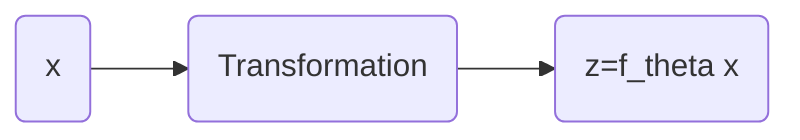

# FLOW

## Foundations of FLOWs

### How to fit a density model

- Maximum Likelihood Estimation (MLE)
  $$ \max_{\theta} \sum_{i=1} \log p_{\theta}(x_i) $$
- Equivalently,
  $$\min_\theta \mathbb{E}_x[-\log p_{\theta}(x)]$$

- One possible solution: **Mixtures of Gaussians**
  $$ p(x) = \sum_{i=1}^K \pi_i \mathcal{N}(x; \mu_i, \Sigma_i) $$
  - And the parameters would be $\theta = (\pi, \mu, \Sigma)$
  - Not appliable to high-dimensional data, as it wouldn't capture the complexity of the data

### FLOWs

#### Main Idea

> **By NOTE**
> $x$ is the original data (or target data with complex distribution $p_{data}(x)$). We want to learn the pattern of $x$. Yet a direct learning is not as easy.
> So we transform $x$ to $z$ using FLOW, with a simple distribution $p_Z(z)$, and then learn the pattern of $z$. Then if we can reverse the transformation, we can get the pattern of $x$ with simple random variable $z$.

- Generally, a FLOW is a mapping from $x$ to $z$ with some certain distributinos $z\sim p_Z(z)$. Specifically, if $z$ is a Gaussian $\mathcal{N}(0,1)$, then it is called **Normalizing Flow**.

#### Change of Variables Formula

Assume that we have a mapping rule $z=f_\theta(x)$ over random variables $x$ and $z$. 

It can be proved that
$$
p_\theta(x) \mathrm{d}x = p(z) \mathrm{d}z,
$$

> **By NOTE**
> Personally I would say that although the random variable has been transformed from one to another, but in a grand view of a event from happening, the shift in space would not affect the probablities. Thus this euqation holds.
> Here, LI Hongyi's explanation is that if we scale down to a very small area $\mathrm{d}x$ and $\mathrm{d}z$, then both of them would approximately follow a uniform distribution, with their total area being the same (i.e. 1, to be precise).

and thus we've got the *Change of Variables* Formula:
$$
p_\theta(x) = p(f_\theta(x)) \left| \frac{\partial f_\theta(x)}{\partial x} \right|,
$$
where $f_\theta$ is required to be invertible and differentiable.

#### General Procedures of FLOW

***Flow: Training***

With the *Change of Variables* Formula, we can transform $x^{(i)}$ into
$$
z^{(i)} = f_\theta(x^{(i)}),
$$
and thus according to the *Change of Variables* Formula
$$
\begin{aligned}
p_\theta(x^{(i)}) &= p_Z(z^{(i)}) \left| \frac{\partial z^{(i)}}{\partial x^{(i)}} \right| \\
&= p_Z(f_\theta(x^{(i)})) \left| \frac{\partial f_\theta}{\partial x}(x^{(i)}) \right|,
\end{aligned}
$$
and finally we can transform the MLE problem into
$$
\max_\theta \sum_{i} \log p\theta(x^{(i)}) = \max_\theta \sum_{i} \log p_Z(f_\theta(x^{(i)})) + \log \left| \frac{\partial f_\theta}{\partial x}(x^{(i)}) \right|.
$$

Presumably we have known the expression for $p_Z$, and then such problem could be solved by Stochastic Gradient Descent (SGD).

***Flow: Sampling***

**Step 1**：Sample $z\sim p_Z(z)$

**Step 2**：Transform $z$ into $x$ by $x=f_\theta^{-1}(z)$

#### Practical Parameterizations of Flows (choose of $f_\theta$)

**Requirement**: Invertible and Differentiable

- Cumulative Density Functions
  - e.g. Gaussian mixture density, mixture of logistic densities

- Neural Net
  - If each layer FLOW, then sequencing of layers = FLOW
  - Each layer:
    - ReLU? NO
    - Sigmoid? YES

#### How general are FLOWs?

***Inverse CDF Sampling Technique***

For any kind of distributions, we can use the CDF to sample from it.
Supposedly we have $F_\theta(x)$, then we can do the sampling by: 
    
1. Sample $u\sim \mathcal{U}(0,1)$
2. $x = F_\theta^{-1}(u)$

Note that for any CDF, it is *always* invertible and differentiable.

***Generalization Ability of FLOWs***

If we can managed to FLOW:
$$
x \stackrel{\textit{Flow}}{\longrightarrow} u
\\
z \stackrel{\textit{Flow}}{\longrightarrow} u
$$then we can transform $x$ into $z$ via:
$$
x \stackrel{\textit{Flow}}{\longrightarrow} u \stackrel{\textit{Flow}}{\longrightarrow} z
$$ as the *inverse of FLOW is also a FLOW*.

Thus, we can **turn any (smooth) $p(x)$ into any (smooth) $p(z)$**.