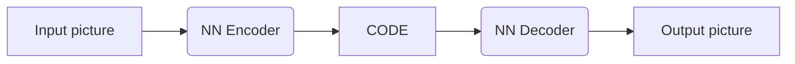
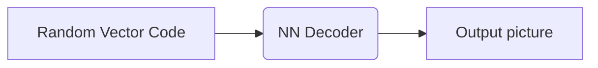

# LIHongyi - VAE & Generative Model
https://openai.com/blog/generative

## PixelRNN
- Image generation
    

- Audio Processing

## Variational Autoencoder (VAE)

### Pre VAE: Auto-encoder

***For training:***

And here we want the output picture to be as similar as the input picture.

***For generation:***

### VAE

- The goal is to :
  - Minimize reconstruction error (difference between input and output)
  - Minimize $\sum_{i=1}^3(1+\sigma_i-m^2-\exp(\sigma_i))$